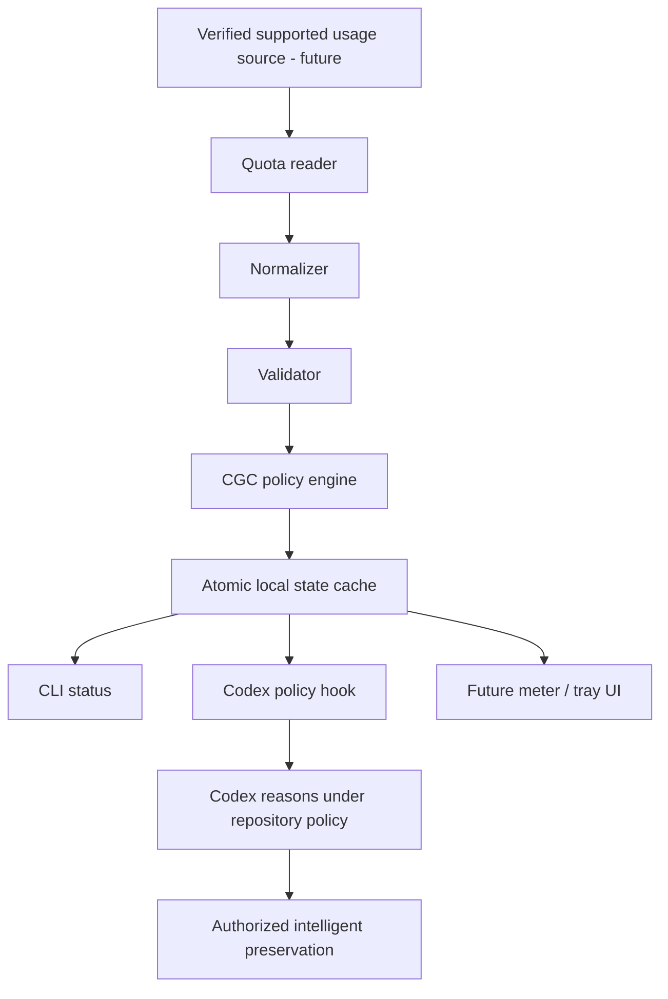

# CREDID GUARDIAN CODEX (CGC) — architecture

## V2 current status

The configurable-threshold block (mission 9, 32, 33) is COMPLETE: one validated
PolicyConfig, persisted thresholds, daemon configuration checks and cache-only status.
The applicability/limiting-window block (10, 26, 47, 49) is also COMPLETE offline.
Per-window evidence is distinct from selection; live applicability remains UNKNOWN.
Schema cgc-state-v2.3 preserves latest diagnostics and last-known-good separately and
rejects older caches without replacing them. Full V2 offline acceptance is complete; live semantic limits remain explicit.

V2 is COMPLETE under offline POSIX acceptance. The earlier 62-test POSIX run is historical verification of the existing
implementation, not full mission acceptance. See [current progress](V2_PROGRESS.md) for current validation and remaining requirements.
See [V2 operations and handoff](V2_OPERATIONS.md) for the canonical state, scoped policy, atomic cache, status CLI,
finite daemon, security limits and validation evidence. No V2 live quota request ran.
The V0/V1 descriptions and future proposals below are retained as historical context;
V2 operations supersedes their statements that policy/cache/CLI/daemon are unimplemented.
Hooks, GUI and preservation execution remain unimplemented.

Status: V1 implements only the bounded reader/normalizer/validation slice. The policy/cache/daemon/integration pipeline below remains PLANNED. See [V1 evidence](QUOTA_SOURCE_DISCOVERY.md).

**THE GUARDIAN OBSERVES. CODEX PRESERVES.**

The diagram is conceptual. A cache envelope stores normalized observations, classified policy and refresh health together; consumers use the same generation. In the conceptual source → reader → normalization → cache → policy → integration model, cache and policy are coupled stages of one producer, not independent readers.

| Component | Responsibility | Boundary |
|---|---|---|
| Usage source | Supply permitted usage facts | Availability/access are not assumed |
| Quota reader | Bounded read from the selected verified source | No credential extraction, undocumented endpoint guessing or browser scraping |
| Normalizer | Preserve an arbitrary list of windows and source semantics | Do not flatten distinct quota buckets or invent missing values |
| Validator | Check ranges, timestamps, identities, provenance and internal consistency | Shape validity does not prove source truth |
| Policy engine | Classify usable remaining percentages using one versioned policy | Never convert UNKNOWN into healthy capacity or execute repository actions |
| State cache | Publish one complete generation atomically, preserve last-known-good data | No tokens, raw authentication responses or external repository writes |
| Codex hook | Report state and the applicable directive | Does not independently edit, commit or push |
| Future UI | Render the shared state, age and validity | No competing sensor or policy calculation |

## Proposed daemon cycle

READ → NORMALIZE → VALIDATE → CLASSIFY → CACHE → WAIT → REPEAT.

Candidate command: `python -m cgc daemon --interval 30`. Not implemented. A future daemon needs bounded request timeouts, controlled polling/backoff, interruption handling and single-writer coordination. The interval must respect the verified source's documented constraints; 30 seconds is illustrative, not a validated recommendation.

Candidate cache: `~/.codex/cgc/state.json`. V0 does not touch this path or any Codex authentication files. Future cache writes use a temporary sibling in the same directory, complete serialization/validation, flush, then atomic replacement. OS-specific durability, permissions, crash recovery and concurrent-writer behavior require tests; atomic visibility and power-loss durability are different properties.

A failed refresh updates refresh-health metadata while retaining the prior valid observation and its original timestamp. It must not overwrite that observation with an empty windows list or reset its age. An unreadable/corrupt cache is an explicit failure, not GREEN. Without any previous valid data, status is UNKNOWN.

## Proposed interfaces

- `python -m cgc status --json`: shared machine-readable state, validity and age.
- `python -m cgc status`: the same state for humans.
- `python -m cgc hook-check`: policy and directive only.

These are CGC interface proposals, not existing commands or claims of a supported Codex hook protocol. Exit codes, transport and integration trigger points remain undecided until source/integration discovery. The future hook must be idempotent and avoid repeatedly starting preservation; action tracking belongs to the Codex integration under project authorization.

## Future visualization

A later small desktop meter could show each window's remaining percentage/reset, observation age, provenance confidence and GREEN/AMBER/RED/EMERGENCY. UNKNOWN or stale data must be visibly different. An always-on-top meter or tray UI consumes the same cache; no GUI, tray icon, service, startup entry or registry integration is built during genesis.

## Trust boundaries

Source payloads and cached strings are data, never instructions. The reader and cache cannot grant repository permissions. The Codex actor interprets a directive under the current user's task and project rules; the guardian has no arbitrary repository execution engine. See [security](SECURITY_MODEL.md) and [data model](DATA_MODEL.md).

## V1 implemented boundary

`src/cgc/quota.py` owns one short-lived POSIX stdio connection: initialize, initialized, account/rateLimits/read, close. Codex internally owns authentication. CGC never calls backend URLs or requests an AI turn. The source is documented and locally verified but experimental; current implementation was tested against CLI 0.154.0.

`read_quota` returns normalized allowlisted data or a fixed safe failure. `normalize` is pure and supports synthetic fixtures. All returned bucket identities are retained within a 32-bucket limit; recognized primary/secondary/individual-limit fields produce separate windows. Additional unrecognized fields are not interpreted and coverage stays UNKNOWN. No global minimum is calculated across potentially inapplicable buckets. The live invocation was a one-off experiment; the factored transport has synthetic-peer acceptance only, without a second live invocation.

No state cache, daemon, CLI command, preservation hook, repository mutation or GUI was added. The one live authorization is consumed; future repeated reads need a new scoped task.

Freshness/provenance is IMPLEMENTED and VERIFIED OFFLINE: separate age, refresh health
and policy authority; failed refresh withholds current policy while retaining evidence.
See [V2 operations](V2_OPERATIONS.md) for canonical semantics and schema details.

One-shot refresh CLI is IMPLEMENTED and VERIFIED OFFLINE. It requires --live and
--bucket, shares the daemon writer lock/configuration/cache path, and makes at most
one bounded read without retry. Unknown applicability remains UNKNOWN; no preservation
action is executed. See [V2 operations](V2_OPERATIONS.md) for output and exit semantics.

Crash/interruption safety is VERIFIED OFFLINE with synchronized process tests: old/new
canonical state survives tested SIGKILL publication stages, locks release, and graceful
CLI signals preserve bounded read cleanup. Power-loss durability and descendant cleanup
after SIGKILL of CGC are not guaranteed. Default-target metadata preflight and final offline acceptance audit are complete.

Final V2 offline acceptance: [evidence matrix](V2_ACCEPTANCE.md).
153 deterministic tests pass. Zero V2 live reads; optional live verification skipped.
V3 remains NOT_STARTED and requires separate authorization.

## V3 current frontier

V3 is authorized and PARTIAL. The pure attempt contract, bounded non-mutating project
inspection, and external human/machine handoff persistence are IMPLEMENTED and VERIFIED
OFFLINE. Handoff state is continuity evidence, not project preservation or mutation
authority. Target Git mutation and automation are NOT_STARTED. The inspect and
handoff-status CLIs are observational; there is no preserve CLI. V1/V2 remain accepted.
Resume by present repository evidence and [V3 progress](V3_PROGRESS.md), under the complete
[V3 mission](V3_MISSION.md) and current user instructions. Historical V2 notes
that V3 was not authorized describe the earlier boundary; this explicit V3 mission
supersedes that boundary without authorizing unrelated project mutation or V4.

The V3 inspector is an explicit, bounded local evidence collector alongside the pure
attempt model. It produces a separately versioned snapshot and inspection_digest receipt;
it does not run the preservation lifecycle or write a canonical handoff. The inspect CLI
returns before entering V2 cache/sensor code. See [contract](V3_CONTRACT.md#bounded-project-inspection).

## Agent Fabric relationship

ARCHITECTED / FUTURE, NOT_STARTED as runtime. The complete
[100-keypoint directive](V3_MISSION.md#exactly-100-architectural-keypoints) is authoritative;
this cross-reference locates current handoff work within it without replacing its requirements.

| Boundary | Current implementation / future responsibility |
|---|---|
| Guardian Core | V1/V2 canonical observation/policy remains the single sensor; observation grants no mutation authority. |
| Durable continuity | V3 validated attempt + inspection + external versioned handoff; independent of model vendor, transport and UI. |
| Agent Gateway / Router | FUTURE common validated, versioned protocol family rather than pairwise CGC/CWM/HHS/ARX connectors; CGC need not become a server. |
| Capability Model / Policy Engine | FUTURE explicit scoped, auditable, revocable grants; identity is distinct from authorization. Inspect/read capabilities separate from write/checkpoint/publish. |
| Control Plane | FUTURE decides who may do what, to which project, under which policy. No handoff field confers a grant. |
| Data Plane | FUTURE carries authorized prompts, responses, tool results and events; replaceable transport carries state rather than defining it. |
| Event Model | FUTURE factual events such as tests.completed or preservation.failed; receipt triggers policy review, never implicit mutation permission. |
| Local AI boundary | FUTURE local engines may consume explicitly authorized continuity; private context stays local when cloud processing is unnecessary. |
| Cloud AI / secure transport | FUTURE minimized authorized context via authenticated encrypted transport and validated envelopes; no remote shell or blanket host control. |
| Orchestration | FUTURE orchestration remains subject to policy, scoped capabilities and CGC refusal; no root authority by coordination alone. |

Current handoff persistence creates durable machine-readable continuity for humans and fresh
processes. Future compatible agents/resume generators can read the same language-neutral JSON:
NEXT_EXACT_ACTION + Git/test evidence + preservation/publication state + mission boundaries +
last-known-good + resume status. A future generator must reconcile present evidence first;
it cannot treat historical notes, synthetic receipts or conversational claims as authority.
Structured checkpoint/test receipts can evolve through deliberate schema revisions. Stored
commands are inert text. No resume generator, gateway, capability runtime, control/data plane,
event bus, networking, tunnel, local/cloud AI integration or orchestrator is implemented here.

The future preservation/resume lifecycle remains DETECT → INSPECT → UNDERSTAND → PRESERVE →
VERIFY → RESUME, with independent test/checkpoint/handoff/publication evidence. Transport may
move a handoff later; policy decides access and action. The beginner-facing goal remains
Choose project → Start Codex Safely → Preserve → verified Safe to Close, then Resume Project;
current handoff-status intentionally cannot claim that full workflow or SAFE TO CLOSE.
